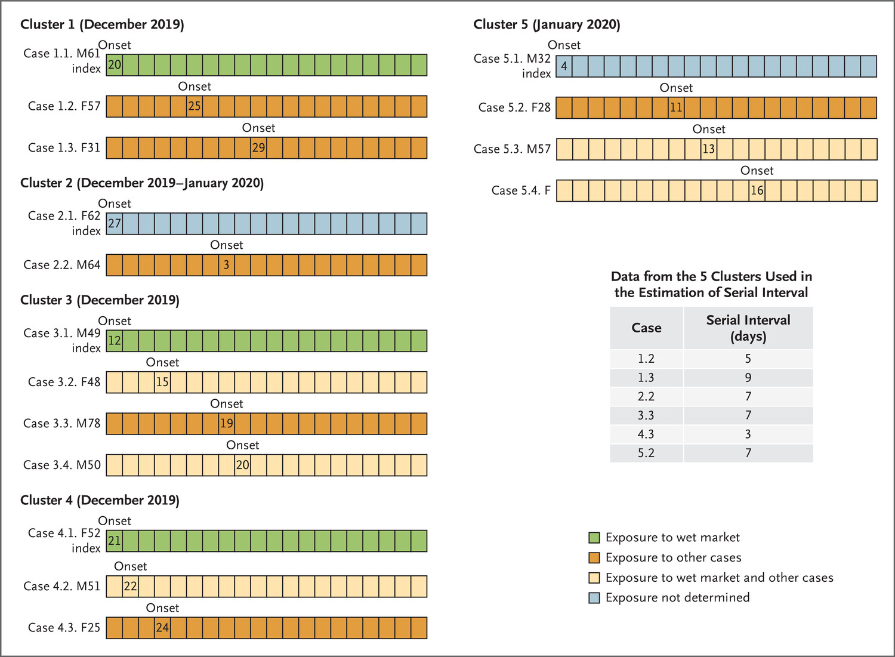

```{r setup, include=FALSE}
knitr::opts_chunk$set(echo = TRUE)
```

### 1. Data source

**Last accessed (Date in YYYY-MM-DD format):** 2024-08-16 

**HTML link to data source:** <https://www.nejm.org/doi/full/10.1056/NEJMoa2001316>

**HTML link or DOI to associated article:** <https://www.nejm.org/doi/full/10.1056/NEJMoa2001316>

**Journal name:** The New England Journal of Medicine (NEJM)

**Data format:** Dataset transcribed from Figure 3 of article

**Additional notes:** Dates of illness onset are available for five clusters. 

```{r Fig, echo = F, fig.align='center', fig.cap="Figure from NEJM article <https://www.nejm.org/doi/full/10.1056/NEJMoa2001316>.", out.width='100%'}

```

### 2. Short data description

There are 16 cases in total. Each case is represented by a row of boxes and numbers in boxes represent calendar dates. Index cases (infectors) and secondary cases are clearly identified. Only 6 pairs involving secondary cases who had a clear exposure to a single index case and had no other potential source of infection were used in the article to estimate the serial interval distribution. The serial interval is defined here as the time delay separating the illness onset date of the infectee (secondary case) and the illness onset date of the infector (primary case). The authors report that the estimated serial interval distribution has a mean (±SD) of 7.5±3.4 days (95% CI, 5.3 to 19). A gamma distribution was fitted to the serial interval data. No censoring is involved. All symptom onset dates are exactly observed at a daily resolution.


### 3. Data processing

The data is now transcribed from the above figure.

```{r calendar dates}
infector_dates <- data.frame(Case_id_infector = c("Case 1.1","Case 1.1", "Case 2.1", 
                                                  "Case 3.1", "Case 4.1", "Case 5.1"),
                             Calendar_date = as.Date(c("2019/12/20", "2019/12/20",
                                                       "2019/12/27", "2019/12/12",
                                                       "2019/12/21", "2020/01/04")))

infectee_dates <- data.frame(Case_id_infector = c("Case 1.2","Case 1.3", "Case 2.2", 
                                                  "Case 3.3", "Case 4.3", "Case 5.2"),
                             Calendar_date = as.Date(c("2019/12/25", "2019/12/29",
                                                       "2020/01/03", "2019/12/19",
                                                       "2019/12/24", "2020/01/11")))

siobs <- infectee_dates$Calendar_date-infector_dates$Calendar_date
```

We use index 1 to refer to the primary case (infector) and index 2 for the secondary case (infectee) and transform the calendar days into interval censored data.

```{r preprocessing}
SIdatnCoV2019 <- data.frame(SL = as.numeric(siobs) - 0.5, SR = as.numeric(siobs) + 0.5)
SIdatnCoV2019

# Export data to local file in txt format
write.table(SIdatnCoV2019, file = "SIdatnCoV2019.txt")
```

